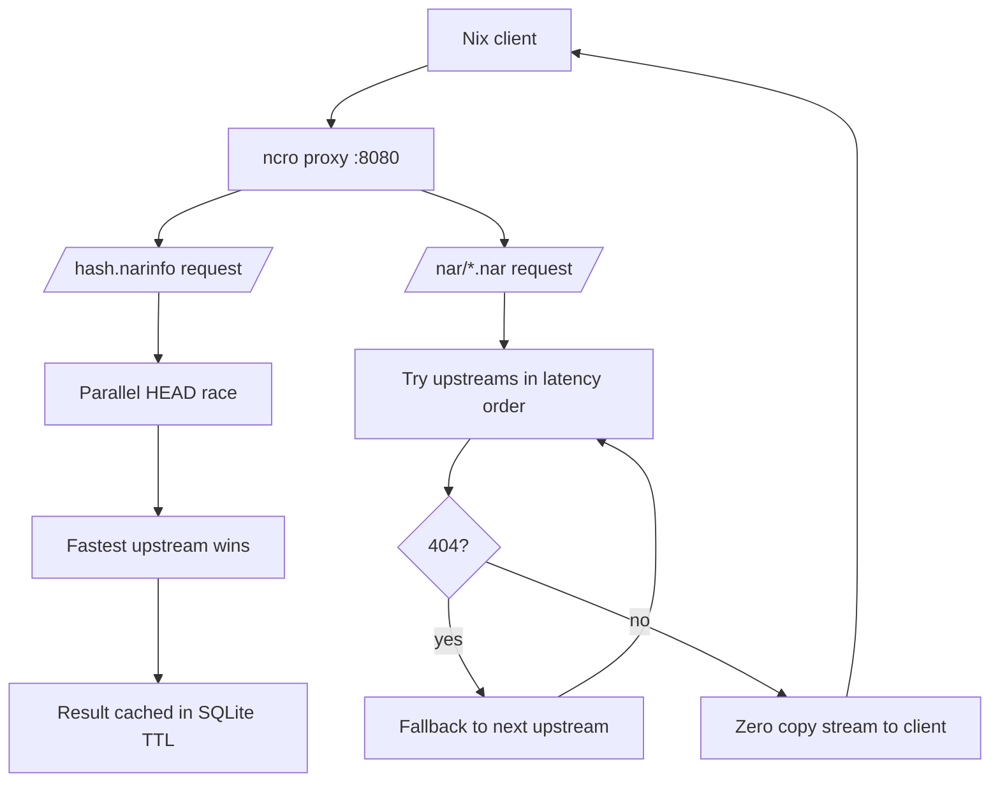

# ncro - Nix Cache Route Optimizer

`ncro` (pronounced Necro) is a lightweight HTTP proxy, inspired by Squid and
several other projects in the same domain, optimized for Nix binary cache
routing. It routes narinfo requests to the fastest available upstream using EMA
latency tracking, persists routing decisions in SQLite and optionally gossips
routes to peer nodes over a mesh network. How cool is that!

[ncps]: https://github.com/kalbasit/ncps

Unlike [ncps], ncro **does not store NARs on disk**. It streams NAR data
directly from upstreams with zero local storage. The tradeoff is simple:
repeated downloads of the same NAR always hit an upstream, but routing decisions
(which upstream to use) are cached and reused. Though, this is _desirable_ for
what ncro aims to be. The optimization goal is extremely domain-specific.

## How It Works



The request flow is quite simplistic:

1. Nix requests `/<hash>.narinfo`
2. ncro checks SQLite route cache; on hit, re-fetches from cached upstream
3. On miss, races HEAD requests to all configured upstreams in parallel
4. Fastest responding upstream wins; narinfo body is fetched and returned
   directly
5. Route is persisted with TTL; subsequent requests use the cache

[architechture reference]: ./docs/architecture.md

Background probes (`HEAD /nix-cache-info`) run every 30 seconds to keep latency
measurements current and detect unhealthy upstreams. You may find additional
details on the project architecture in the [architechture reference]. .

### Runtime Endpoints

- `GET /nix-cache-info`: proxy capability advertisement used by Nix
- `GET /<hash>.narinfo`: route lookup and upstream selection
- `GET /nar/<path>.nar`: streamed NAR content from the chosen upstream
- `GET /metrics`: Prometheus metrics
- `GET /health`: JSON health summary of configured upstreams

### Routing Notes

- Route cache decisions are stored in SQLite and reused until they expire.
- Lower latency wins; when two upstreams are within 10% of each other, the lower
  `priority` value wins.
- Background probes update latency even when no client traffic is flowing.
- If an upstream is missing from the cache, ncro races all configured upstreams
  in parallel and uses the first successful response.

## Quick Start

```bash
# Run with defaults (upstreams: cache.nixos.org, listen: :8080)
$ ncro

# Point at a config file
$ ncro --config /etc/ncro/config.toml

# Tell Nix to use it
$ nix-shell -p hello --substituters http://localhost:8080
```

[installation document]: ./docs/install.md

Deployment instructions are in [installation document].

> [!TIP]
> If you are testing locally, point only a single Nix client at ncro first. That
> makes it easier to see cache behavior and upstream selection in logs.

## Configuration

Default config is embedded; create a TOML file to override any field.

```toml
[server]
listen = ":8080"
read_timeout = "30s"
write_timeout = "30s"

[[upstreams]]
url = "https://cache.nixos.org"
priority = 10 # lower = preferred on latency ties (within 10%)

[[upstreams]]
url = "https://nix-community.cachix.org"
priority = 20

[cache]
db_path = "/var/lib/ncro/routes.db"
max_entries = 100000 # LRU eviction above this
ttl = "1h" # how long a routing decision is trusted
latency_alpha = 0.3 # EMA smoothing factor (0 < alpha < 1)

[logging]
level = "info" # debug | info | warn | error
format = "json" # json | text

[mesh]
enabled = false
bind_addr = "0.0.0.0:7946"
peers = [] # list of {addr, public_key} peer entries
private_key = "" # path to ed25519 key file; empty = ephemeral
gossip_interval = "30s"
```

### Environment Overrides

| Variable         | Config field    |
| ---------------- | --------------- |
| `NCRO_LISTEN`    | `server.listen` |
| `NCRO_DB_PATH`   | `cache.db_path` |
| `NCRO_LOG_LEVEL` | `logging.level` |

Environment overrides are useful for containerized or Systemd deployments where
you want a fixed config file but still need to tweak one or two settings.

## NixOS Integration

```nix
{
  services.ncro = {
    enable = true;
    settings = {
      upstreams = [
        { url = "https://cache.nixos.org"; priority = 10; }
        { url = "https://nix-community.cachix.org"; priority = 20; }
      ];
    };
  };

  # Point Nix at the proxy
  nix.settings.substituters = [ "http://localhost:8080" ];
}
```

Alternatively, if you're not using NixOS, create a Systemd service similar to
this. You'll also want to harden this, but for the sake of brevity I will not
cover that here. Make sure you have `ncro` in your `PATH`, and then write the
Systemd service:

```ini
[Unit]
Description=Nix Cache Route Optimizer

[Service]
ExecStart=ncro --config /etc/ncro/config.toml
DynamicUser=true
StateDirectory=ncro
Restart=on-failure

[Install]
WantedBy=multi-user.target
```

Place it in `/etc/systemd/system/` and enable the service with
`systemctl enable`. In the case you want to test out first, run the binary with
a sample configuration instead.

## Mesh Mode

When `mesh.enabled = true`, ncro creates an ed25519 identity, binds a UDP socket
on `bind_addr`, and gossips recent route decisions to configured peers on
`gossip_interval`. Messages are signed with the node's ed25519 private key and
serialized with msgpack. Received routes are merged into an in-memory store
using a lower-latency-wins / newer-timestamp-on-tie conflict resolution policy.

Each peer entry takes an address and an optional ed25519 public key. When a
public key is provided, incoming gossip packets are verified against it; packets
from unlisted senders or with invalid signatures are silently dropped.

If `mesh.private_key` is left empty, ncro generates an ephemeral identity on
startup. That is fine for testing, but persistent gossip requires a stable key
so peers can recognize the node across restarts.

```toml
[mesh]
enabled = true
private_key = "/var/lib/ncro/node.key"

[[mesh.peers]]
addr = "100.64.1.2:7946"
public_key = "a1b2c3..." # hex-encoded ed25519 public key (32 bytes)

[[mesh.peers]]
addr = "100.64.1.3:7946"
public_key = "d4e5f6..."
```

The node logs its public key on startup (`mesh node identity` log line). You can
share it with peers so they can add it to their config.

> [!TIP]
> Keep mesh traffic on a private network. The gossip protocol is signed, but it
> is still meant for trusted peers. ncro's mesh network feature was designed
> with Tailscale in mind.

## Metrics

Prometheus metrics are available at `/metrics`.

<!--markdownlint-disable MD013-->

| Metric                                    | Type      | Description                              |
| ----------------------------------------- | --------- | ---------------------------------------- |
| `ncro_narinfo_cache_hits_total`           | counter   | Narinfo requests served from route cache |
| `ncro_narinfo_cache_misses_total`         | counter   | Narinfo requests requiring upstream race |
| `ncro_narinfo_requests_total{status}`     | counter   | Narinfo requests by status (200/error)   |
| `ncro_nar_requests_total`                 | counter   | NAR streaming requests                   |
| `ncro_upstream_race_wins_total{upstream}` | counter   | Race wins per upstream                   |
| `ncro_upstream_latency_seconds{upstream}` | histogram | Race latency per upstream                |
| `ncro_route_entries`                      | gauge     | Current route entries in SQLite          |

<!--markdownlint-enable MD013-->

> [!TIP]
> If you are tuning upstreams, watch `ncro_upstream_latency_seconds` and
> `ncro_upstream_race_wins_total` together. The first shows raw response timing;
> the second shows which cache host is actually being chosen.

## Operational Tips

- Use `priority` to break ties between similarly fast caches, not to override a
  clearly slower upstream.
- Put `db_path` on persistent storage if you want routing decisions to survive
  restarts.
- Use a small `ttl` while testing and a larger one in production to reduce
  upstream probing.
- Keep `cache.nix.org` and any private caches in the upstream list, with the
  most trusted cache first.
- If you run behind a firewall or container network, make sure the listen port
  is reachable from your Nix clients.

## Hacking

### Building

```bash
# With Nix (recommended)
$ nix build

# With Cargo directly
$ cargo build --release

# Development shell
$ nix develop
$ cargo test
```
