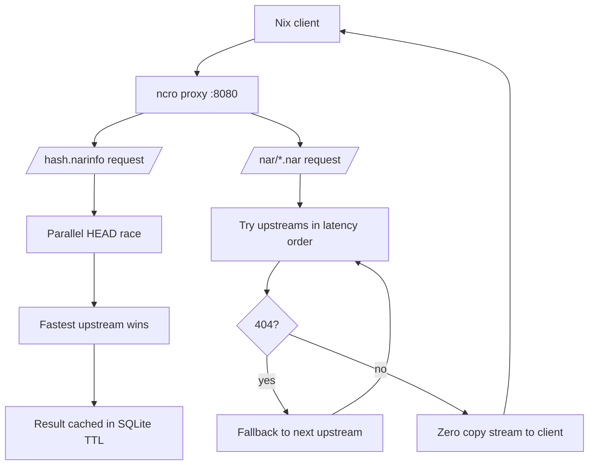

<!-- markdownlint-disable MD033 MD041 -->

<div id="doc-begin" align="center">
  <h1 id="header">
    <pre>ncro</pre>
  </h1>
  <p>
    <b>N</b>ix <b>C</b>ache <b>R</b>oute <b>O</b>ptimizer
  </p>
  <br/>
  <a href="#synopsis">Synopsis</a><br/>
  <a href="#quick-start">Quick Start</a> | <a href="#configuration">configuration</a><br/>
  <a href="#hacking">Contributing</a>
  <br/>
</div>

## Synopsis

`ncro` (pronounced Necro) is a lightweight HTTP proxy, inspired by Squid and
several other projects in the same domain, optimized for Nix binary cache
routing. It routes narinfo requests to the fastest available upstream using EMA
latency tracking, persists routing decisions in SQLite and optionally gossips
routes to peer nodes over a mesh network. How cool is that!

[ncps]: https://github.com/kalbasit/ncps

Unlike [ncps], ncro **does not store NARs on disk**. It streams NAR data
directly from upstreams with zero local storage. The tradeoff is simple:
repeated downloads of the same NAR always hit an upstream, but routing decisions
(which upstream to use) are cached and reused. Though, this is _desirable_ for
what ncro aims to be. The optimization goal is extremely domain-specific.

### Motivation

During a Nix build, binaries are downloaded from configured substituters, also
known as binary caches. When multiple caches serve the same paths or you have
multiple caches configured in your Nix setup, there is additional wait time and
overhead to every build. ncro solves this by acting as an _intelligent local
proxy_ that measures upstream latency in real time and routes each request to
the fastest responder. To keep ncro small and lightweight, routing metadata is
persisted on disk; NAR content is streamed through with zero local storage. This
keeps the proxy stateless on the data path and eliminates cache-invalidation
complexity.

[architechture document]: ./docs/architecture.md

For a deeper look at the system design, see the [architechture document].

### How It Works



The request flow follows two distinct paths depending on the request type:

### Narinfo Lookups

1. Nix requests `/<hash>.narinfo`
2. ncro checks the SQLite route cache; on a hit, it re-fetches from the cached
   upstream without probing others
3. On a miss, it races HEAD requests to all configured upstreams in parallel
4. The fastest upstream wins; the full narinfo body is fetched from that
   upstream and returned to the client
5. The winning route is persisted with a configurable TTL; subsequent requests
   for the same hash use the cached route directly

### NAR Streaming

1. Nix requests `/nar/<hash>.nar`
2. ncro looks up the route for the corresponding narinfo hash; if no route is
   found (e.g. the narinfo was requested directly from an upstream), it tries
   upstreams in latency order
3. The NAR body is streamed chunk-by-chunk from the selected upstream to the
   client with zero buffering on disk
4. If the upstream returns 404, ncro falls through to the next upstream in
   latency order
5. After all upstreams are exhausted with no success, a 404 is returned

Background probes (`HEAD /nix-cache-info`) run every 30 seconds to keep latency
measurements current and detect unhealthy upstreams. System design is covered
further in the [architechture document].

### Runtime Endpoints

- `GET /nix-cache-info`: proxy capability advertisement used by Nix
- `GET /<hash>.narinfo`: route lookup and upstream selection
- `GET /nar/<path>.nar`: streamed NAR content from the chosen upstream
- `GET /metrics`: Prometheus metrics
- `GET /health`: JSON health summary of configured upstreams

### Routing Notes

- Route cache decisions are stored in SQLite and reused until their TTL expires
  (or they are evicted by the LRU policy when `max_entries` is reached).
- Latency is tracked using an Exponentially Weighted Moving Average (EMA) with a
  configurable smoothing factor (`cache.latency_alpha`, default 0.3). Higher
  alpha values react faster to changes; lower values filter out measurement
  noise.
- Lower latency wins the race. When two upstreams are within 10% of each other,
  the lower `priority` value acts as a tiebreaker.
- Background probes (`HEAD /nix-cache-info`) update latency estimates every 30
  seconds even when no client traffic is flowing, ensuring warm routing data.
- On a cache miss, ncro races all configured upstreams in parallel and returns
  the first successful response. Unhealthy upstreams (detected by consecutive
  probe failures) are excluded from the race until they recover.

## Quick Start

```bash
# Run with defaults (upstreams: cache.nixos.org, listen: :8080)
$ ncro

# Point at a config file
$ ncro --config /etc/ncro/config.toml

# Tell Nix to use it
$ nix-shell -p hello --substituters http://localhost:8080
```

[installation document]: ./docs/install.md

Deployment instructions are in [installation document].

> [!TIP]
> If you are testing locally, point only a single Nix client at ncro first. That
> makes it easier to see cache behavior and upstream selection in logs.

## Configuration

Default config is embedded; create a TOML file to override any field.

```toml
[server]
listen = ":8080"
read_timeout = "30s"
write_timeout = "30s"

[[upstreams]]
url = "https://cache.nixos.org"
priority = 10 # lower = preferred on latency ties (within 10%)

[[upstreams]]
url = "https://nix-community.cachix.org"
priority = 20

# S3-compatible cache (MinIO, Garage, etc.)
[[upstreams]]
url      = "s3://my-bucket?endpoint=minio.example.com&scheme=https"
priority = 15
username = "access-key-id"
password = "secret-access-key"

# Private HTTP cache requiring Basic Auth
[[upstreams]]
url      = "https://cache.internal.example.com"
priority = 5
username = "ncro"
password = "hunter2" # it says ******* on my screen it's secure!

[cache]
db_path = "/var/lib/ncro/routes.db"
max_entries = 100000 # LRU eviction above this
ttl = "1h" # how long a routing decision is trusted
negative_ttl = "10m" # cache misses for a short window
latency_alpha = 0.3 # EMA smoothing factor (0 < alpha < 1)

[cache.mass_query]
max_concurrent_races = 64 # total concurrent narinfo races
per_upstream_max_inflight = 8 # per-upstream narinfo head concurrency
in_memory_negative_ttl = "5s" # short-lived miss suppression
upstream_cooldown = "15s" # cooldown on transient upstream network errors

[logging]
level = "info" # debug | info | warn | error
format = "json" # json | text

[discovery]
enabled = false
service_name = "_nix-serve._tcp" # mDNS service type to browse
domain = "local"                 # mDNS domain
discovery_time = "5s"            # how long to listen per discovery cycle
priority = 20                    # priority assigned to discovered upstreams
address_family = "any"           # "any" | "ipv4" | "ipv6"

[mesh]
enabled = false
bind_addr = "0.0.0.0:7946"
peers = [] # list of {addr, public_key} peer entries
private_key = "" # path to ed25519 key file; empty = ephemeral
gossip_interval = "30s"
```

### Environment Overrides

| Variable         | Config field    |
| ---------------- | --------------- |
| `NCRO_LISTEN`    | `server.listen` |
| `NCRO_DB_PATH`   | `cache.db_path` |
| `NCRO_LOG_LEVEL` | `logging.level` |

Environment overrides are useful for containerized or Systemd deployments where
you want a fixed config file but still need to tweak one or two settings.

### S3 Upstreams

ncro accepts Nix-style `s3://` URLs in the `url` field and translates them to
their HTTP(S) equivalent at startup. The rest of the system sees a plain HTTP
URL. No special runtime path is needed.

Supported query parameters:

<!--markdownlint-disable MD013-->

| Parameter  | Description                                                                                                                         |
| ---------- | ----------------------------------------------------------------------------------------------------------------------------------- |
| `endpoint` | Custom S3-compatible host (MinIO, Garage, Backblaze, …). When set, path-based addressing is used: `{scheme}://{endpoint}/{bucket}`. |
| `scheme`   | `http` or `https`. Only meaningful with `endpoint`. Default: `https`.                                                               |
| `region`   | AWS region. Produces virtual-hosted endpoint `{bucket}.s3.{region}.amazonaws.com`.                                                  |
| `profile`  | AWS credential profile. Accepted but currently ignored; unauthenticated or `username`/`password`-based auth should be used instead. |

<!--markdownlint-enable MD013-->

```toml
# S3-compatible store with a custom endpoint
[[upstreams]]
url      = "s3://my-bucket?endpoint=minio.example.com&scheme=https"
priority = 15
username = "access-key-id"
password = "secret-access-key"

# AWS S3 bucket with explicit region (public or IAM-anonymous)
[[upstreams]]
url      = "s3://my-nix-cache?region=eu-west-1"
priority = 20
```

> [!NOTE]
> Authenticated AWS requests using SigV4 (i.e. `profile=`) are not yet
> supported. For private S3-compatible stores, use `username`/`password` with
> HTTP Basic Auth. For AWS S3, make the bucket publicly readable or use a
> pre-signed URL proxy in front of ncro.

### Upstream Authentication

Any upstream can carry `username` and `password` fields. ncro itself sends HTTP
Basic Auth on every request to that upstream: health probes, narinfo races, and
NAR streaming.

```toml
[[upstreams]]
url      = "https://cache.internal.example.com"
priority = 5
username = "ncro"
password = "hunter2"
```

`password` is optional. Omit it for token-only schemes where the token goes in
the username field.

## NixOS Integration

```nix
{
  services.ncro = {
    enable = true;
    settings = {
      upstreams = [
        { url = "https://cache.nixos.org"; priority = 10; }
        { url = "https://nix-community.cachix.org"; priority = 20; }
      ];
    };
  };

  # Point Nix at the proxy
  nix.settings.substituters = [ "http://localhost:8080" ];
}
```

Alternatively, if you're not using NixOS, create a Systemd service similar to
this. You'll also want to harden this, but for the sake of brevity I will not
cover that here. Make sure you have `ncro` in your `PATH`, and then write the
Systemd service:

```ini
[Unit]
Description=Nix Cache Route Optimizer

[Service]
ExecStart=ncro --config /etc/ncro/config.toml
DynamicUser=true
StateDirectory=ncro
Restart=on-failure

[Install]
WantedBy=multi-user.target
```

Place it in `/etc/systemd/system/` and enable the service with
`systemctl enable`. In the case you want to test out first, run the binary with
a sample configuration instead.

## Discovery Mode

When `discovery.enabled = true`, ncro browses the local network for mDNS
services matching `service_name` (default `_nix-serve._tcp`) and registers each
discovered instance as a dynamic upstream with `priority`.

Every routable address advertised by a discovered service is registered
separately. When `address_family = "any"` (default), both IPv4 and IPv6
addresses are added so the router's race engine can try them in parallel. Set
`address_family = "ipv4"` or `address_family = "ipv6"` to restrict to one
family. This is _generally_ useful when your binary cache server only listens on
one stack (e.g. nix-serve binds `0.0.0.0` by default and does not accept IPv6
connections.)

Discovered upstreams are removed when they have not been seen for three
`discovery_time` intervals.

```toml
[discovery]
enabled = true
service_name = "_nix-serve._tcp"
domain = "local"
discovery_time = "5s"
priority = 20
address_family = "ipv4" # restrict to IPv4-only caches
```

## Mesh Mode

When `mesh.enabled = true`, ncro creates an ed25519 identity, binds a UDP socket
on `bind_addr`, and gossips recent route decisions to configured peers on
`gossip_interval`. Messages are signed with the node's ed25519 private key and
serialized with msgpack. Received routes are merged into an in-memory store
using a lower-latency-wins / newer-timestamp-on-tie conflict resolution policy.

Each peer entry takes an address and an optional ed25519 public key. When a
public key is provided, incoming gossip packets are verified against it; packets
from unlisted senders or with invalid signatures are silently dropped.

If `mesh.private_key` is left empty, ncro generates an ephemeral identity on
startup. That is fine for testing, but persistent gossip requires a stable key
so peers can recognize the node across restarts.

```toml
[mesh]
enabled = true
private_key = "/var/lib/ncro/node.key"

[[mesh.peers]]
addr = "100.64.1.2:7946"
public_key = "a1b2c3..." # hex-encoded ed25519 public key (32 bytes)

[[mesh.peers]]
addr = "100.64.1.3:7946"
public_key = "d4e5f6..."
```

The node logs its public key on startup (`mesh node identity` log line). You can
share it with peers so they can add it to their config.

> [!TIP]
> Keep mesh traffic on a private network. The gossip protocol is signed, but it
> is still meant for trusted peers. ncro's mesh network feature was designed
> with Tailscale in mind.

## Metrics

Prometheus metrics are available at `/metrics`.

<!--markdownlint-disable MD013-->

| Metric                                    | Type      | Description                              |
| ----------------------------------------- | --------- | ---------------------------------------- |
| `ncro_narinfo_cache_hits_total`           | counter   | Narinfo requests served from route cache |
| `ncro_narinfo_cache_misses_total`         | counter   | Narinfo requests requiring upstream race |
| `ncro_narinfo_requests_total{status}`     | counter   | Narinfo requests by status (200/error)   |
| `ncro_nar_requests_total`                 | counter   | NAR streaming requests                   |
| `ncro_upstream_race_wins_total{upstream}` | counter   | Race wins per upstream                   |
| `ncro_upstream_latency_seconds{upstream}` | histogram | Race latency per upstream                |
| `ncro_route_entries`                      | gauge     | Current route entries in SQLite          |

<!--markdownlint-enable MD013-->

> [!TIP]
> If you are tuning upstreams, watch `ncro_upstream_latency_seconds` and
> `ncro_upstream_race_wins_total` together. The first shows raw response timing;
> the second shows which cache host is actually being chosen.

## Operational Tips

- Use `priority` to break ties between similarly fast caches, not to override a
  clearly slower upstream.
- Put `db_path` on persistent storage if you want routing decisions to survive
  restarts.
- Use a small `ttl` while testing and a larger one in production to reduce
  upstream probing.
- Keep `cache.nix.org` and any private caches in the upstream list, with the
  most trusted cache first.
- If you run behind a firewall or container network, make sure the listen port
  is reachable from your Nix clients.

## Hacking

This project is built with NixOS in mind and naturally the primary means of
working on this project is using Nix for a reproducible developer environment.
Use `nix develop` to enter a development shell, or `direnv allow` to use the
provided `.envrc` if you use [Direnv](https://direnv.net).

### Building

```bash
# With Nix (recommended)
$ nix build

# With Cargo directly
$ cargo build --release

# Development shell
$ nix develop
$ cargo test
```

## License

<!--markdownlint-disable MD033 MD059-->

[provided here]: https://interoperable-europe.ec.europa.eu/sites/default/files/custom-page/attachment/eupl_v1.2_en.pdf

This project is made available under European Union Public Licence (EUPL)
version 1.2. See [LICENSE](LICENSE) for more details on the exact conditions. An
online copy is [provided here].

<div align="right">
  <a href="#doc-begin">Back to the Top</a>
  <br/>
</div>

<!--markdownlint-enable MD033 MD059-->
