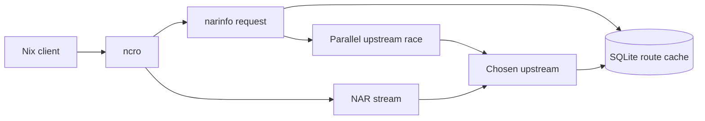
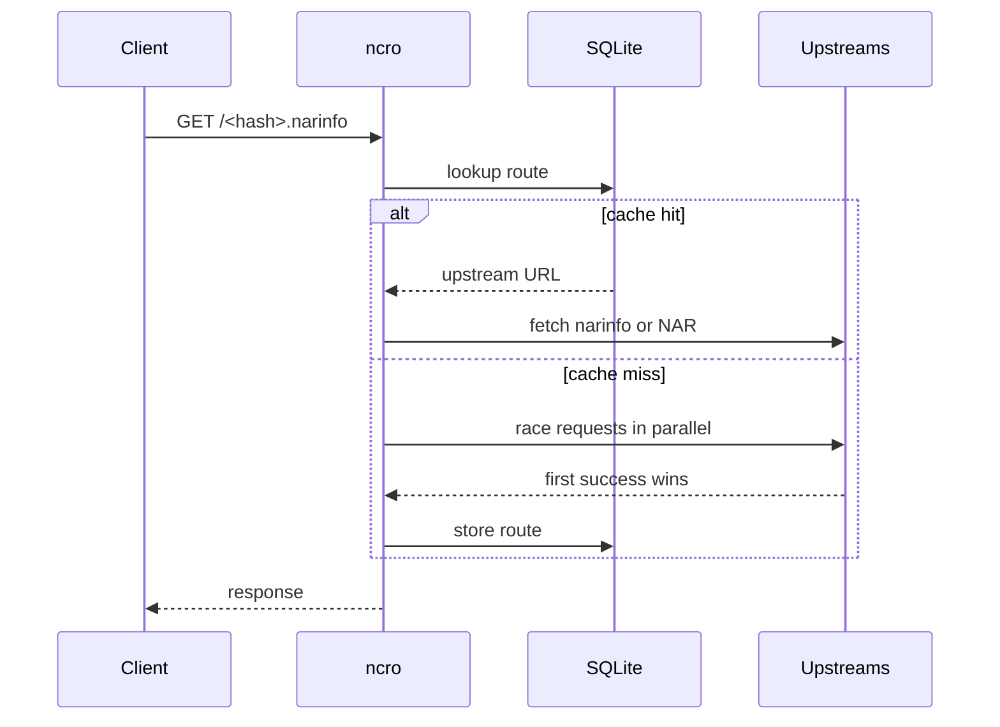
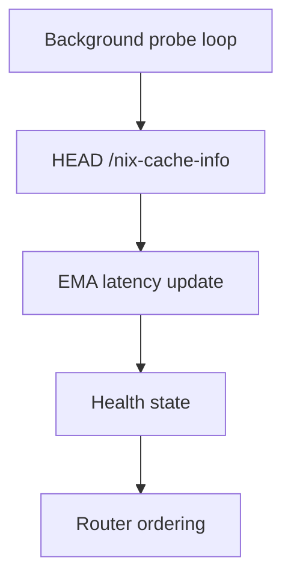
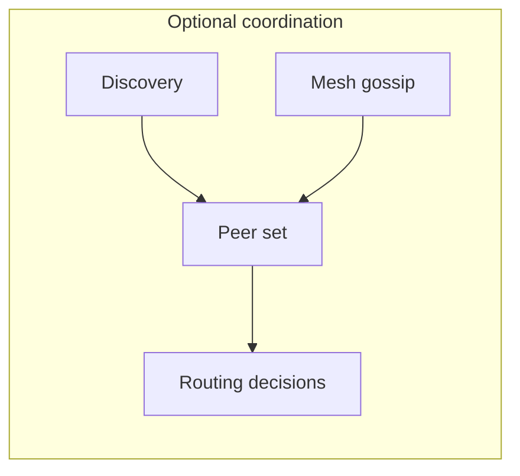

# Architecture

`ncro` is a Nix cache router. It sits in front of one or more upstream caches,
learns which upstream answers fastest for a given path, and reuses that decision
until it expires.

The routing path is simple: a narinfo lookup first checks SQLite, then falls
back to a parallel race across upstreams when there is no usable entry. The
winning upstream is stored with a TTL, so later requests can skip the race.

Background health probes keep latency estimates current by calling
`HEAD /nix-cache-info` on a timer. The health layer uses EMA smoothing, so a
single bad probe does not immediately dominate the routing decision.

Selection is driven by latency first. When two upstreams are effectively tied,
`priority` breaks the tie. The router also tracks failures and probe volume so it
can distinguish a briefly slow cache from one that is trending unhealthy.

Persistence is intentionally narrow. SQLite stores route decisions and health
snapshots so a restart does not force ncro to relearn everything from scratch.

Discovery and mesh are optional extensions. Discovery can add peers from the
local network, while mesh gossip shares recent route decisions across trusted
nodes using signed UDP packets.

At runtime, ncro loads config, validates it, opens SQLite, seeds health state,
starts background loops, and finally binds the HTTP listener. Shutdown is driven
by the normal process termination path and background work is told to stop
gracefully.

## Configuration Reference

The most important settings are `upstreams`, `server.listen`, `cache.db_path`,
`cache.ttl`, `cache.negative_ttl`, `cache.latency_alpha`, `server.cache_priority`,
`discovery.enabled`, and `mesh.enabled`.

`upstreams` defines the cache backends ncro can use. Each upstream can carry a
`priority` value and an optional `public_key` for mesh verification.

`cache.ttl` is how long a successful routing decision remains trusted. The
negative TTL applies to failed lookups so ncro does not immediately retry the
same miss.

`cache.latency_alpha` controls how quickly EMA latency reacts to new probes. A
smaller value smooths jitter; a larger value reacts faster to recent changes.

`server.cache_priority` is used when the server layer needs to compare cache
responses. It should stay positive.

`discovery.enabled` and `mesh.enabled` turn on the optional network-coordination
paths described above. Discovery is opportunistic; mesh is signed and intended
for trusted peers.
