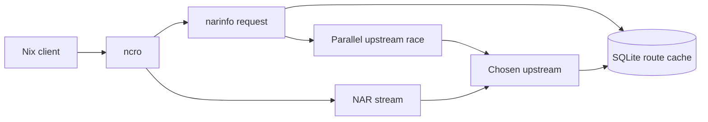
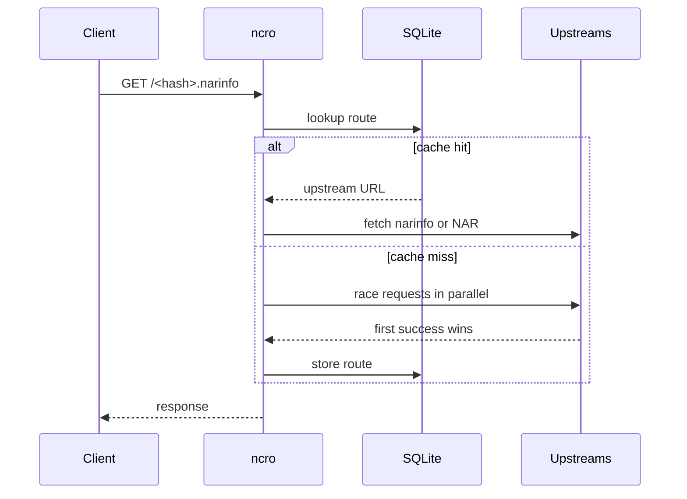
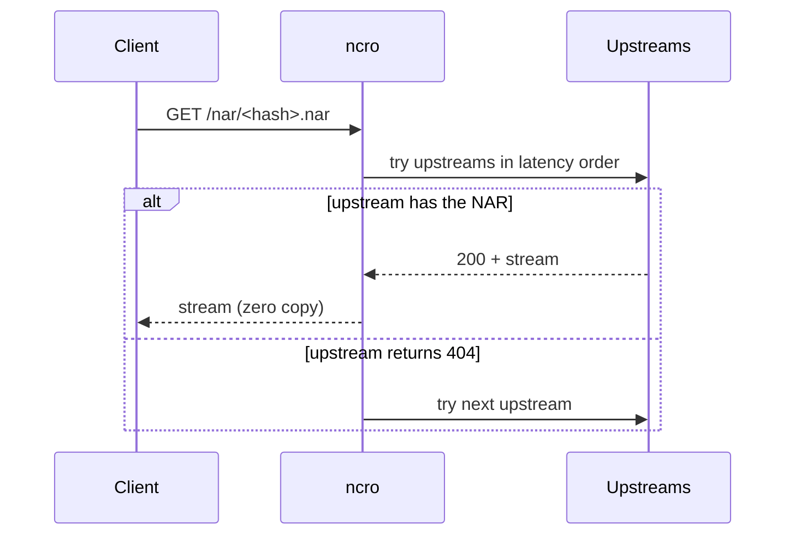
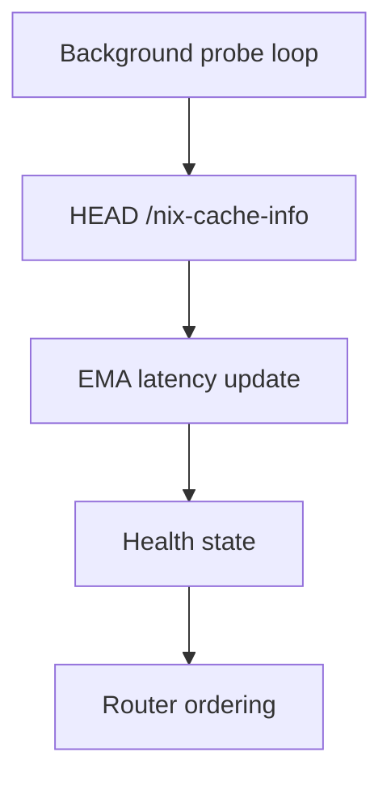
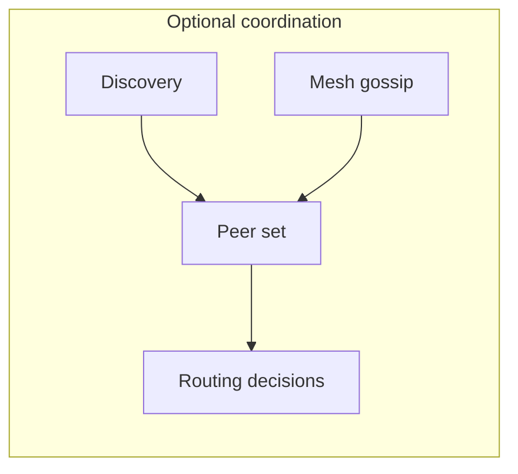

# Architecture

`ncro` is a Nix cache router. It sits in front of one or more upstream caches,
learns which upstream answers fastest for a given path, and reuses that decision
until it expires.

The routing path is simple: a narinfo lookup first checks SQLite, then falls
back to a parallel race across upstreams when there is no usable entry. The
winning upstream is stored with a TTL, so later requests can skip the race.

NAR streaming, on another hand, follows a different path. There is actually no
race and when a client requests `/nar/<hash>.nar`, ncro looks up the route for
the corresponding narinfo hash. _If_ a route exists, it opens a connection to
the winning upstream and streams the response body directly to the client
without buffering to disk. If no route exists, it tries upstreams in latency
order, falling through on 404 until one succeeds.

Background health probes keep latency estimates current by calling
`HEAD /nix-cache-info` every 30 seconds. The health layer uses Exponentially
Weighted Moving Average (EMA) smoothing, so a single bad probe does not
immediately dominate the routing decision:

$$
L_t = \alpha \cdot R_t + (1 - \alpha) \cdot L_{t-1}
$$

Where $R_t$ is the latest observed latency, $L_t$ is the new estimate, and
`alpha` (`cache.latency_alpha`, default `0.3`) controls how quickly the estimate
adapts. Higher values react faster to real changes; lower values filter out
noise.

Selection is driven by latency first. When two upstreams are effectively tied,
`priority` breaks the tie. The router also tracks failures and probe volume so
it can distinguish a briefly slow cache from one that is trending unhealthy.

> [!TIP]
> Persistence is intentionally narrow. SQLite stores two kinds of data so a
> restart does not force ncro to relearn everything from scratch.

First type of stored data is **route entries**, a mapping from narinfo hash to
the winning upstream URL, stored with a creation timestamp and TTL. When the
cache exceeds `max_entries`, the least recently used entry is evicted first.
**Health snapshots** on another hand are per-upstream EMA latency estimates and
failure counts, refreshed by the background probe loop.

Discovery and mesh are optional extensions. Discovery can add peers from the
local network, while mesh gossip shares recent route decisions across trusted
nodes using signed UDP packets. Consider:

At runtime, ncro loads config, validates it, opens SQLite, seeds health state,
starts background loops, and finally binds the HTTP listener. The HTTP server
and all background tasks run on tokio's async runtime, allowing concurrent
upstream connections without thread-per-connection overhead. Shutdown is driven
by the normal process termination path and background work is told to stop
gracefully.

## Configuration Reference

The most important settings are `upstreams`, `server.listen`, `cache.db_path`,
`cache.ttl`, `cache.negative_ttl`, `cache.latency_alpha`,
`server.cache_priority`, `discovery.enabled`, `discovery.address_family`, and `mesh.enabled`.

`upstreams` defines the cache backends ncro can use. Each upstream can carry a
`priority` value and an optional `public_key` for mesh verification.

`cache.ttl` is how long a successful routing decision remains trusted. The
negative TTL applies to failed lookups so ncro does not immediately retry the
same miss.

`cache.latency_alpha` controls how quickly EMA latency reacts to new probes. A
smaller value smooths jitter; a larger value reacts faster to recent changes.

`server.cache_priority` is used when the server layer needs to compare cache
responses. It should stay positive.

`discovery.enabled` and `mesh.enabled` turn on the optional network-coordination
paths described above. Discovery is opportunistic; mesh is signed and intended
for trusted peers.

`discovery.address_family` controls which addresses from an mDNS-discovered
peer are registered as upstreams. The default `any` registers all routable
addresses (IPv4 and IPv6) so the race engine can try them in parallel. Set
`ipv4` or `ipv6` when the upstream server only listens on one address family.
